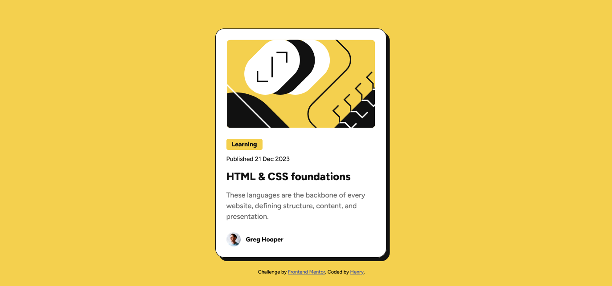

# Frontend Mentor - Blog preview card solution

This is a solution to the [Blog preview card challenge on Frontend Mentor](https://www.frontendmentor.io/challenges/blog-preview-card-ckPaj01IcS). Features include the distinct offset box-shadow, Figtree typography, and dynamic hover/focus states for the card and title link, meeting all accessibility requirements. 

## Table of contents

- [Overview](#overview)
  - [The challenge](#the-challenge)
  - [Screenshot](#screenshot)
  - [Links](#links)
- [My process](#my-process)
  - [Built with](#built-with)
  - [What I learned](#what-i-learned)
  - [Continued development](#continued-development)
  - [Useful resources](#useful-resources)
- [Author](#author)

## Overview

### The challenge

Users should be able to:

- See hover and focus states for all interactive elements on the page

### Screenshot



### Links

- Solution URL: [https://github.com/Henrydevlab/blog-preview-card](https://github.com/Henrydevlab/blog-preview-card)
- Live Site URL: [https://henrydevlab.github.io/blog-preview-card/](https://henrydevlab.github.io/blog-preview-card/)

## My process

### Built with

- Semantic HTML5 markup
- CSS custom properties (Variables) for colors
- Flexbox for layout (e.g., centering the card, aligning the author profile)
- Figtree Font from Google Fonts (Weights 500 and 800)
- Git (Version control)
- [GitHub Pages](https://pages.github.com/) - Deployment/Hosting

### What I learned

During this project, I learnt on how to implement the following CSS techniques:

1. Unique Offset Box Shadow: I successfully replicated the design's signature "lifted" look by setting the blur and spread of the box-shadow to 0px and using a large, equal pixel value for the horizontal and vertical offsets (8px 8px).

2. Accessible Focus States: To make the entire card react to keyboard users, I used the :focus-within pseudo-class on the parent <article> element.

3. Smooth Transitions: I used transition: all 0.3s ease; to make the shadow change and the "lift" feel smooth and intentional on hover and focus.

```css
.blog-card {
    /* Base shadow and transition setup */
    box-shadow: 8px 8px 0px 0px var(--clr-gray-950);
    transition: box-shadow 0.3s ease, transform 0.3s ease;
}

.blog-card:hover,
.blog-card:focus-within {
    /* Increased offset and lift */
    box-shadow: 16px 16px 0px 0px var(--clr-gray-950);
    transform: translate(-4px, -4px); 
}
```

### Continued development

In future projects, I plan to focus on these areas to refine my CSS skills:

1. Fluid Typography with clamp(): I want to move beyond fixed rem units for typography. I will use the clamp() function to define font sizes (e.g., the title) to achieve a more dynamic and fluid scaling between mobile and desktop widths without relying on traditional media queries.

2. BEM Naming Convention: I intend to adopt a stricter BEM (Block Element Modifier) approach to class naming (e.g., using .blog-card__image instead of .card-image) to ensure greater clarity and maintainability for future components.

### Useful resources

- [MDN Web Docs - :focus-within](https://developer.mozilla.org/en-US/docs/Web/CSS/:focus-within) - This resource was vital for correctly implementing the accessible focus state, allowing the parent card to show the lift effect when the inner title link is tabbed to.
- [CSS-Tricks: A Complete Guide to Flexbox](https://css-tricks.com/snippets/css/a-guide-to-flexbox/) - An excellent comprehensive guide I referenced for quickly setting up the layout, including the centering of the card and the precise alignment of the author profile.
- [MDN Web Docs - clamp()](https://developer.mozilla.org/en-US/docs/Web/CSS/clamp) - A key resource for my continued development, as I plan to use this function in future projects to implement more fluid typography that scales smoothly between mobile and desktop breakpoints.
- [Get BEM (Block Element Modifier)](http://getbem.com/) - A helpful resource for understanding the principles behind a strict naming convention, which I aim to adopt for better CSS organization and scalability.
- [Figtree on Google Fonts](https://fonts.google.com/specimen/Figtree) - The source for the project's typography, ensuring the correct weights (500 and 800) were imported and applied.

## Author

- Frontend Mentor - [@henrydevlab](https://www.frontendmentor.io/profile/henrydevlab)
- Twitter - [@henrydevlab](https://www.x.com/henrydevlab)